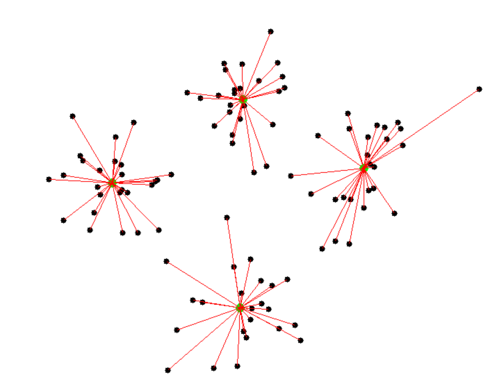

# Summary – Units 4 to 6
**Module:** Machine Learning  
**Student:** Ajayeb Mohammed S. H. Al-Bedewi  
**Period Covered:** Units 4–6  

---

## Overview
Units 4–6 focused on applying machine learning techniques for regression and clustering using Python and Scikit-Learn. These units helped develop skills in modeling, evaluating, and interpreting both linear relationships and clusters in real datasets. Each unit also emphasized professional teamwork, critical appraisal of methods, and communication of analytical results.

---

## Unit 4 – Linear Regression with Scikit-Learn
This unit introduced the application of linear regression using Scikit-Learn. I learned to model relationships between a single independent variable and a dependent variable, as well as between multiple independent variables and a dependent variable.

### Key Takeaways
- Applied linear and multivariate regression techniques using Python  
- Learned how to evaluate model effectiveness using metrics such as R² and Pearson correlation  
- Developed understanding of regression assumptions and how to optimize models  
- Enhanced coding proficiency and ability to interpret results critically

### Linked Learning Outcomes
- **LO2:** Understand dataset applicability and challenges in regression modeling  
- **LO3:** Apply and critically appraise linear regression techniques  
- **LO4:** Communicate findings effectively and collaborate professionally

---

## Unit 5 – Clustering (Theory, Class Activities, and e-Portfolio Work)
This unit focused on the theoretical foundations of clustering, including grouping objects, distance measurements, K-Means and Agglomerative clustering, and evaluating clusters. Class activities involved interactive animations, wiki collaboration, and e-Portfolio exercises.

### Class Activities Completed
- Watched two clustering animations:  
  1. Standard clustering visualization  
  2. “I’ll choose” + “Uniform Points” option to explore different initialization effects  
- Participated in the module wiki activity:  
  - Shared insights about cluster relationships observed in animations  
  - Commented on peers’ posts to enhance collaborative learning  
- Reviewed external resources on K-Means clustering:  
  - [Naftali Harris: Visualizing K-Means Clustering](https://www.naftaliharris.com/blog/visualizing-k-means-clustering/)  
  - [K-Means Interactive Visualization](https://shabal.in/visuals/kmeans/4.html)  
- **Completed e-Portfolio activity – Jaccard Coefficient Calculations:**  
  - Converted asymmetric variables to binary (Y & P = 1; N & A = 0)  
  - Calculated Jaccard coefficient for pairs:  
    - **(Jack, Mary) = 0.33**  
    - **(Jack, Jim) = 0.67**  
    - **(Jim, Mary) = 0.75**  

### Key Takeaways
- Developed understanding of clustering logic and algorithm rationale  
- Recognized how initial conditions and point distributions impact cluster formation  
- Gained skills in evaluating cluster quality using similarity measures such as the **Jaccard coefficient**  
- Strengthened teamwork and peer learning through wiki discussions

### Linked Learning Outcomes
- **LO2:** Understand the principles and challenges of clustering datasets  
- **LO3:** Apply clustering concepts and critically evaluate results  
- **LO4:** Communicate insights and collaborate effectively in team-based tasks

### Related Artefacts
-   
-   
-   

---

## Unit 6 – Clustering with Python
This unit applied K-Means clustering on real-life datasets using Python and Scikit-Learn. It focused on practical implementation, evaluation, and interpretation of clustering results.

### Key Takeaways
- Applied K-Means clustering using Scikit-Learn libraries  
- Learned to evaluate and interpret clustering results for data-driven decision-making  
- Strengthened Python programming skills in a practical, real-world context  
- Updated the e-Portfolio and collaborated on team-based analytical projects

### Linked Learning Outcomes
- **LO2:** Undertake clustering analysis on large datasets and understand data limitations  
- **LO3:** Use Python libraries to implement and evaluate clustering algorithms  
- **LO4:** Collaborate professionally, report results, and update the e-Portfolio

---

## Reflection
Across Units 4–6, I enhanced my practical ML skills, particularly in regression and clustering. I gained confidence in using Python for data modeling, learned to evaluate results critically, and improved teamwork and communication in analytical tasks. The inclusion of interactive animations, wiki-based peer feedback, and Jaccard coefficient calculations highlighted the value of visual, collaborative, and quantitative learning. These units prepared me for more complex data analysis projects and real-world machine learning applications.

---

## Related Artefacts
- [Unit6_Artefacts](../../Units/Unit4-6/Artefacts)  
- [Unit6_Seminar_and_Recording](../../Units/Unit4-6/Seminar_Recordings.md)  
- [Unit6_Feedback](../../Units/Unit4-6/Feedback.md)  

---

## Learning Outcomes Covered
- **LO2:** Applicability and challenges of datasets in ML  
- **LO3:** Application and critical appraisal of ML techniques  
- **LO4:** Professional teamwork and communication skills
